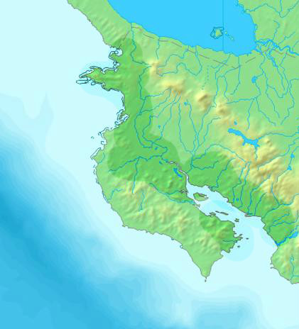
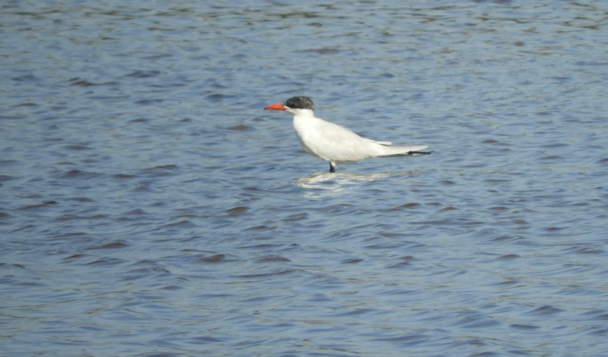

Jose Guillermo Ramirez Bogantes

####Introducción 

En Costa Rica el Golfo de Nicoya (Figura 1) es un sitio de gran importancia para las aves migratorias debido a la amplitud de sus mareas y a  las características  del sustrato de la zona, sin embargo esta zona también se ha visto afectada negativamente por la intervención del hombre, que ha eliminado zonas de humedales alterando así el ecosistema.

Figura 1:  Golfo de Nicoya Guanacaste 
\
\

Para este caso se realizaron visitas a tres lugares (1) Reserva Nacional de Vida Silvestre Mata Redonda, (2)  Las salineras de Cocorocas y (3) Las lagunas camaroneras en Chomes; en cada sitio se realizó una observación directa de las aves  para ver su comportamiento.  

####Objetivos: de la Gira

+ Observar los diversos hábitats disponibles para las aves acuaticas y terrestres.
+ Aplicar técnicas de ecología para descripcion de comportamientos.
+ Reconocer los problemas ambientales. 

\
\

Resultados:

Se presentan los cuadros con el listado taxonómico de las especies que observaron en los tres sitios.

*Hydroprogne caspia* visto en una laguna utilizada para la producción de camaron

**Cuadro de las especies encontradas en las lagunas camaroneras en Chomes** 

Cantidad Individuos|Orden| Familia| Especie        | Estatus| Semillas| Insectos| Moluscos| Frutas| Peces | Otros
-------------------|-----|--------|----------------|--------|---------|---------|---------|-------|-------|-------
1|Pelecaniformes|Ardeidae|*Ardea alba*|R,M| |x| | |x| 
1|Accipitriformes|Accipitridae|*Buteogallus anthracinus*|R||||||pequeños vertebrados 
1|Pelecaniformes|Ardeidae|Butorides virescens|R,M||x|||x|pequeños vertebrados 
60|	Charadriiformes|	Scolopacidae| 	*Calidris mauri*|	M|	|	x|	|	|	|	
15	|Charadriiformes	|Scolopacidae |	*Calidris minutilla*	|M	|	|x	|	|	|	|
1	|Passeriformes|	Troglodytidae| 	*Campylorhynchus rufinucha*|	R|	|	x|	|	|	|	
3|	Cathartiformes|	Cathartidae |	*Cathartes aura*|	R,M	|	|	|	|	|	|Carroña
23|	Charadriiformes|	Charadriidae| 	*Charadrius semipalmatus*|	M|	|	x|	|	|	|	
5|	Columbiformes|	Columbidae| 	*Columbina inca*|	R|	x|	|	|	|	|	
8	|Columbiformes	|Columbidae 	|*Columbina passerina*	|R	|x	|	|	|	|	|
3	|Cathartiformes|	Cathartidae |	*Coragyps atratus*|	R|	|	|	|	|	|	Carroña Y pequeños vertebrados 
12|	Pelecaniformes|	Ardeidae |	*Egretta caerulea*|	R,M	|	|x	|	|	|x	|
5	|Pelecaniformes|	Ardeidae| 	*Egretta thula*|	R,M|	|	|	|	|	x|	
1	|Pelecaniformes	|Threskiornithidae |	*Eudocimus albus*	|R	|	|x	|	|	|	|
2	|Psittaciformes|	Psittacidae |	*Eupsittula canicularis*|	R|	X|	| 	|	X|	|	
1|	Falconiformes|	Falconidae| 	*Falco peregrinus*|	M|	|	|	|	|	|	pequeños vertebrados 
4	|Suliformes	|Fregatidae 	|*Fregata magnificens*	|R	|	|	|	|	|x	|
107|	Charadriiformes|	Recurvirostridae| 	*Himantopus mexicanus*|	R,M|	|	X|	|	|	|	
1	|Charadriiformes	|Laridae 	|*Hydroprogne caspia*	|M	|	|	|	|	|X	|
1|	Passeriformes|	Icteridae| 	*Icterus pustulatus*|	R|	X|	X|	|	X|	|	
2	|Accipitriformes	|Accipitridae 	|*Ictinia plumbea*	|RR,M	|	|X	|	|	|	|pequeños vertebrados 
3	|Charadriiformes|	Laridae |	*Leucophaeus atricilla*	|M	||	X|	|	|	X|	Carroña
30|	Charadriiformes	|Scolopacidae 	|*Limnodromus griseus*	|M	|	|X	|	|	|	|
1	|Accipitriformes|	Pandionidae| 	*Pandion haliaetus*|	M|	|	|	|	|	X|	
1|	Passeriformes	|Parulidae 	|*Parkesia noveboracensis*	|M	|	|X	|X	|	|	|
45|	Passeriformes|	Hirundinidae| 	*Petrochelidon pyrrhonota*|	M|	|	X|	|	|	|	
1|	Passeriformes	|Passerellidae 	|*Peucaea ruficauda*	|R	|X	|X	|	|	|	|
2	|Suliformes|	Phalacrocoracidae| 	*Phalacrocorax brasilianus*	|R|	|	|	|	|	X|	
15	|Passeriformes	|Hirundinidae 	|*Progne chalybea*	|R	|	|X	|	|	|	|
2	|Passeriformes|	Icteridae |	*Quiscalus mexicanus*|	R|	|	X|	|	X|	|	Carroña Y pequeños vertebrados 
1	|Passeriformes|	Parulidae |	*Setophaga petechia*|	R,M	|	|X	|	|	|	|
13|	Charadriiformes|	Scolopacidae| 	*Tringa flavipes*|	M|	|	X|	|	|	|	
28|	Charadriiformes	|Scolopacidae 	|*Tringa semipalmata*|	M	|	|X	|	|	|	|
2	|Columbiformes|	Columbidae| 	*Zenaida asiatica*|	R,M|	X|	|	|	|	|	
***
\
\

**Cuadro de las especies encontradas en la Reserva Nacional de Vida Silvestre Mata Redonda**

Cantidad Individuos|Orden| Familia| Especie        | Estatus| Semillas| Insectos| Moluscos| Frutas| Peces | Otros
-------------------|-----|--------|----------------|--------|---------|---------|---------|-------|-------|-------
1|	Psittaciformes|	Psittacidae |	*Amazona albifrons*|	R	|x	|	||	x	|	|
2	|Pelecaniformes|	Ardeidae| 	*Ardea alba*|	R,M|	|	x|	|	|	x|	
1	|Pelecaniformes|	Ardeidae 	|*Ardea herodias*|	M	|	|x	|	|	|x	|pequeños vertebrados 
167|	Pelecaniformes|	Ardeidae |	*Bubulcus ibis*|	R,M|	|	x|	|	|	|	
1	|Passeriformes	|Corvidae 	|*Calocitta formosa*	|R	|	|x	|	|x	||	pequeños vertebrados 
1	|Passeriformes|	Troglodytidae| 	*Campylorhynchus rufinucha*|	R|	|	x|	|	|	|	
25|	Falconiformes|	Falconidae |	*Caracara cheriway*	|R	|	|	|	|	||	Carroña Y pequeños vertebrados 
5	|Cathartiformes|	Cathartidae| 	*Cathartes aura*|	R,M|	|	|	|	|	|	Carroña
1	|Columbiformes	|Columbidae 	|*Columbina inca*	|R	|x	|	|	|	|	|
2	|Columbiformes|	Columbidae| 	*Columbina passerina*|	R|	x|	|	|	|	|	
6	|Cathartiformes	|Cathartidae 	|*Coragyps atratus*|	R	|	|	|	|	|	|Carroña Y pequeños vertebrados 
8	|Cuculiformes|	Cuculidae| 	*Crotophaga sulcirostris*|	R|	|	x|	|	|	|	
1	|Coraciiformes	|Momotidae 	|*Eumomota superciliosa*	|R	|	|x	|	|	|	|
1	|Falconiformes|	Falconidae |	*Herpetotheres cachinnans*|	R|	|	|	|	|	|	pequeños vertebrados 
90|	Passeriformes|	Hirundinidae| 	*Hirundo rustica*|	M|	|	|	|	|	|	
21|	Ciconiiformes|	Ciconiidae 	|*Jabiru mycteria*	|R	|	|X	|	|	|X	|pequeños vertebrados 
2	|Charadriiformes|	Jacanidae	|*Jacana spinosa*|	R|	|	X|	|	|	X|	pequeños vertebrados 
2|	Columbiformes|	Columbidae| 	*Leptotila verreauxi*|	R|	X|	|	|	|	|	
2	|Piciformes|	Picidae| 	*Melanerpes hoffmannii*|	R-END|	|	x|	|	x|	|	
36|	Ciconiiformes|	Ciconiidae| 	*Mycteria americana*|	R,M|	|	X|	|	|	|	
1	|Passeriformes|	Tyrannidae|	*Myiarchus crinitus*|	M|	|	X|	|	X|	|	
1	|Accipitriformes|	Accipitridae| 	*Parabuteo unicinctus*|	R,M|	|	|	|	|	|	pequeños vertebrados 
4	|Passeriformes|	Icteridae| 	*Quiscalus mexicanus*|	R|	|	X|	|	X|	|	Carroña Y pequeños vertebrados 
1	|Passeriformes|	Tyrannidae|	*Sublegatus arenarum*|	R|	|	X|	|	X|	|	
3	|Charadriiformes|	Laridae |	*Tigrisoma mexicanum*|	M|	|	X|	|	|	X|	
3	|Passeriformes|	Tyrannidae|	*Tyrannus melancholicus*|	R|	X|	X|	|	X|	|	
1	|Columbiformes|	Columbidae| 	*Zenaida asiatica*|	R,M|	X|	|	|	|	|	
***
\
\

 

Lagunas utilizadas para extraer sal

Picinas para extraccion de sal 

**Cuadro de las especies encontradas en  Las salineras de Cocorocas**

Cantidad Individuos|Orden| Familia| Especie        | Estatus| Semillas| Insectos| Moluscos| Frutas| Peces | Otros
-------------------|-----|--------|----------------|--------|---------|---------|---------|-------|-------|-------
1	|Charadriiformes|	Scolopacidae| 	*Actitis macularius*|	M|	|	x|	|	|	x|	
1|	Psittaciformes|	Psittacidae| 	*Amazona albifrons*|	R|	x|	|	|	x|	|	
1	|Pelecaniformes|	Ardeidae| 	*Ardea alba*|	R,M|	|	x|	|	|	x|	
8|	Charadriiformes|	Scolopacidae| 	*Arenaria interpres*|	M|	|	|	|	|	|	
4	|Psittaciformes|	Psittacidae| 	*Brotogeris jugularis*|	R|	x|	|	|	x|	|	
1	|Accipitriformes|	Accipitridae| 	*Buteo albonotatus*|	R,M|	|	|	|	|	|	pequeños vertebrados 
1	|Accipitriformes|	Accipitridae| 	*Buteo plagiatus*|	R|	|	|	|	|	|	pequeños vertebrados 
1	|Accipitriformes|	Accipitridae| 	*Buteogallus anthracinus*|	R|	|	|	|	|	|	pequeños vertebrados 
1|	Pelecaniformes|	Ardeidae| 	*Butorides virescens*|	R,M|	|	x|	|	|	x|	pequeños vertebrados 
140	|Charadriiformes|	Scolopacidae |	*Calidris mauri*|	M|	|	x|	|	|	|	
1|	Charadriiformes|	Scolopacidae| 	*Calidris minutilla*|	M|	|	x|	|	|	|	
1	|Cathartiformes|	Cathartidae |	*Cathartes aura*|	R,M	|	|	|	||		|Carroña
35|	Charadriiformes|	Charadriidae| 	*Charadrius semipalmatus*|	M|	|	x|	|	|	|	
60|	Charadriiformes|	Charadriidae| 	*Charadrius wilsonia*|	R,M|	|	x|	|	|	|	
4|	Columbiformes|	Columbidae| 	*Columbina inca*|	R|	x|	|	|	|	|	
1|	Columbiformes|	Columbidae |	*Columbina passerina*|	R|	x|	|	|	|	|	
15|	Cathartiformes|	Cathartidae| 	*Coragyps atratus*|	R|	|	|	|	|	|	Carroña Y pequeños vertebrados 
3|	Pelecaniformes|	Ardeidae |	*Egretta caerulea*|	R,M|	|	x|	|	|	x|	
1|	Pelecaniformes|	Ardeidae| 	*Egretta thula*|	R,M|	|	|	|	|	x|	
1|	Pelecaniformes|	Ardeidae| 	*Egretta tricolor*|	R,M|	|	x|	|	|	x|	
76|	Pelecaniformes|	Threskiornithidae| 	*Eudocimus albus*|	R|	|	x|	|	|	|	
3|	Psittaciformes|	Psittacidae| 	*Eupsittula canicularis*|	R|	X|	|	|	X|	|	
2|	Suliformes|	Fregatidae| 	*Fregata magnificens*|	R|	|	|	|	|	x|	
41|	Charadriiformes|	Laridae| 	*Gelochelidon nilotica*|	M|	|	|	|	|	|	
35|	Charadriiformes|	Recurvirostridae| 	*Himantopus mexicanus*|	R,M|	|	X|	|	|	|	
1|	Passeriformes	|Hirundinidae |	*Hirundo rustica*|	M|	|	X|	|	|	|	
1|	Passeriformes|	Icteridae| 	*Icterus pustulatus*|	R|	X|	X|	|	X|	|	
6|	Charadriiformes|	Laridae| 	*Leucophaeus atricilla*|	M|	|	X|	|	|	X|	Carroña
87|	Charadriiformes|	Scolopacidae| 	*Limnodromus griseus*|	M|	|	X|	|	|	|	
75|	Charadriiformes|	Scolopacidae| 	*Limosa fedoa*|	M|	|	x|	|	|	x|	
1|	Falconiformes|	Falconidae| 	*Milvago chimachima*|	R|	|	X|	|	|	|	Carroña Y pequeños vertebrados 
1|	Passeriformes|	Tyrannidae|	*Myiarchus crinitus*|	M|	|	X|	|	X|	|	
1|	Passeriformes|	Tyrannidae|	*Myiarchus panamensis*|	R|	|	X|	|	X|	|	
2|	Passeriformes|	Tyrannidae|	*Myiozetetes similis*|	R|	X|	X|	|	X|	|	
160|	Charadriiformes|	Scolopacidae| 	*Numenius phaeopus*|	M|	|	X|	|	X|	|	
1|	Pelecaniformes|	Ardeidae| 	*Nycticorax nycticorax*|	R,M|	|	X|	|	|	X|	pequeños vertebrados 
1|	Accipitriformes|	Pandionidae| 	*Pandion haliaetus*|	M|	|	|	|	|	X|	
2|	Columbiformes|	Columbidae| 	*Patagioenas flavirostris*|	R|	X|	|	|	|	|	
2|	Passeriformes|	Tyrannidae|	*Pitangus sulphuratus*|	R|	|	X|	|	|	|	pequeños vertebrados 
3	|Pelecaniformes|	Threskiornithidae| 	*Platalea ajaja*|	R|	|	|	X|	|	X|	
130	|Charadriiformes|	Charadriidae |	*Pluvialis squatarola*|	M|	|	X|	|	|	|	
7|	Passeriformes	|Icteridae| 	*Quiscalus mexicanus*	|R|	|	X|	|	X|	|	Carroña Y pequeños vertebrados 
16|	Charadriiformes|	Laridae| 	*Rynchops niger*|	M|	|	X|	|	|	|	
1|	Passeriformes|	Thraupidae| 	*Saltator coerulescens*|	R|	|	X|	|	X|	|	
1	|Passeriformes|	Parulidae| 	*Setophaga petechia*|	R,M|	|	X|	|	|	|	
2|	Passeriformes|	Tyrannidae|	*Sublegatus arenarum*|	R|	|	X|	|	X|	|	
15|	Charadriiformes|	Laridae| 	*Thalasseus maximus*|	M|	|	|	|	|	X|	
5|	Charadriiformes|	Laridae| 	*Thalasseus sandvicensis*|	M|	|	|	|	|	X|	
50|	Charadriiformes|	Scolopacidae| 	*Tringa semipalmata*|	M|	|	X|	|	|	X|	
2|	Columbiformes|	Columbidae| 	*Zenaida asiatica*|	R,M|	X|	|	|	|	|	
37|	Charadriiformes|	Scolopacidae| 	*Arenaria interpres*|	M|	|	x|	|	|	|	
45|	Charadriiformes|	Scolopacidae| 	*Calidris mauri*|	M|	o|	x|	|	|	|	
15|	Charadriiformes|	Charadriidae |	*Charadrius semipalmatus*|	M|	|	x|	|	|	|	
20|	Charadriiformes|	Charadriidae| 	*Charadrius wilsonia*|	R,M|	|	x|	|	|	|	
3|	Pelecaniformes|	Ardeidae |	*Egretta caerulea*|	R,M|	|	x|	|	|	x|	
53|	Pelecaniformes|	Threskiornithidae| 	*Eudocimus albus*|	R|	|	x|	|	|	|	
1|	Falconiformes|	Falconidae| 	*Falco columbarius*|	M|	|	X|	|	|	|	pequeños vertebrados 
45|	Charadriiformes|	Laridae| 	*Gelochelidon nilotica*|	M|	|	x|	|	|	x|	
50|	Charadriiformes|	Recurvirostridae| 	*Himantopus mexicanus*|	R,M|	|	X|	|	|	|	
80|	Charadriiformes|	Laridae| 	*Leucophaeus atricilla*|	M|	|	X|	|	|	X|	Carroña
140|	Charadriiformes|	Scolopacidae| 	*Limosa fedoa*|	M|	|	x|	|	|	x|	
1|	Falconiformes	|Falconidae| 	*Milvago chimachima*|	R|	|	X|	|	|	|	Carroña Y pequeños vertebrados 
1|	Charadriiformes|	Scolopacidae| 	*Numenius americanus*|	M|	|	X|	|	X|	|	
120|	Charadriiformes|	Scolopacidae| 	*Numenius phaeopus*|	M|	|	X|	|	X|	|	
70|	Charadriiformes|	Charadriidae| 	*Pluvialis squatarola*|	M|	|	X|	|	|	|	
5|	Passeriformes|	Icteridae| 	*Quiscalus mexicanus*|	R|	|	X|	|	X|	|	Carroña Y pequeños vertebrados 
25|	Charadriiformes|	Laridae |	*Rynchops niger*|	M|	|	X|	|	|	|	
40|	Charadriiformes|	Laridae| 	*Thalasseus maximus*|	M|	|	|	|	|	X|	
3|	Charadriiformes|	Scolopacidae| 	*Tringa semipalmata*|	M|	|	X|	|	|	X|	
1|	Passeriformes|	Tyrannidae|	*Tyrannus forficatus*|	M|	X|	X|	|	X|	|	
***
\
\
\

**Referencias bibliográficas** 
\
Barrantes, G., & Pereira, A. (1992). Abundancia y fluctuaciones de aves limícolas (Charadriiformes) en una playa fangosa de Chomes, Costa Rica. Revista de Biología Tropical, 303-307.

Garrigues, Richard., P. Camacho-Varela, M. Montoya, P. O’Donnell, O. Ramírez-Alán, J. Zook. 2018. Lista Oficial de las Aves de Costa Rica – Actualización 2018. Comité de Especies Raras y Registros Ornitológicos de Costa Rica (Comité Científico), Asociación Ornitológica de Costa Rica. Zeledonia 22:2. San José, Costa Rica.

